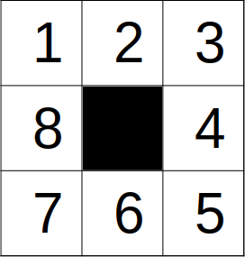

# Solving Monopoly with Linear Algebra

Some details are given below, but you could check [slides](./slides.pdf) or
YouTube videos [[1]](https://www.youtube.com/watch?v=6145wsWtScM) and
[[2]](https://www.youtube.com/watch?v=vvDQJ0QLN08) for more details.

## Linear game

In this simple game we have:

* Linear game track.
* Single standard six-sided die.

When the game will end?

## Looping game

In this a bit more complicated game we have:

* Looping game track.
* Single standard six-sided die.

How likely we are to see a player visiting 8th square on 1st turn? 3rd?
100th? After infinite number of turns?

## Monopoly

... is a bit more complicated game. We have:

* Two standard six-sided dice are rolled. Roll again if doubles.
* Looped track with 40 squares + special "In Jail" square.
* "Chance" (?) and "Community chest" (chest) cards.
* Complicated jail mechanics.
* Game ends as players go bankrupt.

Note: here "complicated" is not the same "complicated" as in games like
Twilight Imperium. Yet still.

